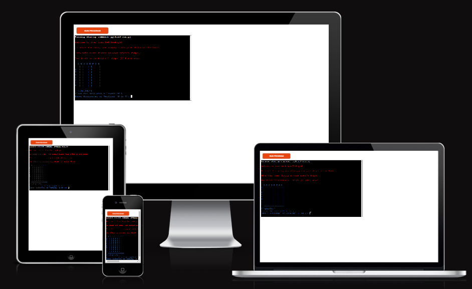
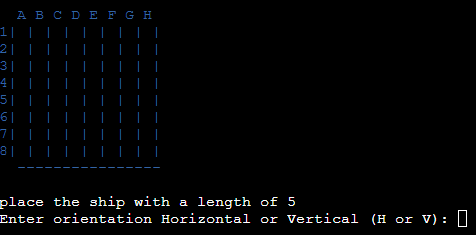
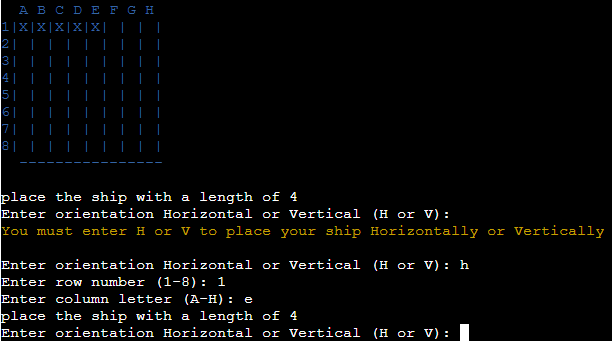
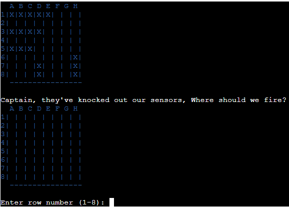
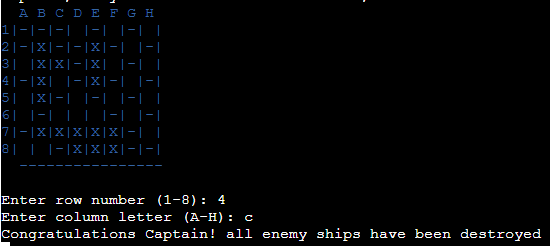
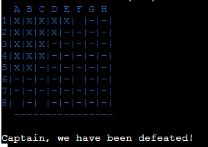
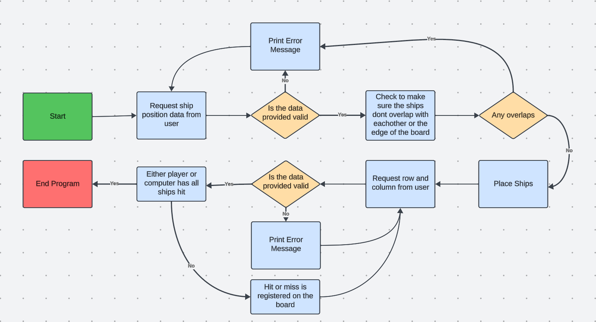
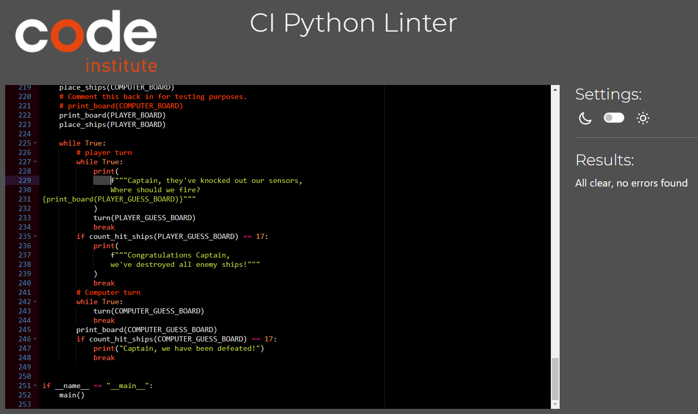

<h1>Star Trek Battleships</h1>

## Overview

Star Trek Battleships is a single player, python terminal game where players can play a classic battleships style game by placing their ships and then taking turns firing at the computer board.

The game can be found deployed on Heroku with this [Link](https://star-trek-battleships-ae86cac7948c.herokuapp.com/) or by pasting the folloing into your web browser https://star-trek-battleships-ae86cac7948c.herokuapp.com/

## How to play

<h3>To start the game:</h3>

- The player will be promted to place all 5 ships of diffent lengths.
- First they will choose if the ship will be horizontal or vertical.
- Then they will choose a row number and collumn letter to place the ship in.
- The first cell of the ship will be placed in the cell they chose, with the
remaing cells stretching either horizontally or vertically depending on what 
the player chose.
- Ships cannot be placed on top of eachother or in a position that they would
overlap the board.
- Once all ships are placed the player will chose which row and column they
want to fire at.
- If all computer ships are destroyed then the player wins.
- If all player ships are destroyed then the computer wins.

link to the game https://star-trek-battleships-ae86cac7948c.herokuapp.com/

## User Stories
<h3>First Time Visitor Goals:</h3>

- As a first-time visitor, I want to easily understand the main purpose of the game and what it does.
- As a first-time visitor, I want to easily navigate the controls of the game.
- As a first-time visitor, I want to quickly start the game since that's what I'm here for.

<h3>Returning Visitor Goals:</h3>

- As a returning visitor, I want to try my luck again.
- As a returning visitor, I want to see the same familiar game layout so I can get straight into a new game.

## Features

<h3>When the game is loaded:</h3>

- The user can see a welcome message with promps on how to get started.
 

- The Board will be printed and the player will choose where to place their ships
 
- The computer will also randomly place thier ships

- If the player enters nothing, enters something invalid or enters a position that overlaps with other ships or the edge of the board, they will be asked to try again.
 

- Once all ships are placed the user can see their board and the computer board and will be asked to choose a row and column to fire at on the computer board.
 
- The computer will fire at random locations after each player turn. The computer cannot fire where they have fired already.

- Once either the computer or the player has destroyed all ships (17 hits) the game is over

## Flowchart

- The flowchart represents the logic of the application:

## Technologies Used

- [Python 3.8.5](https://www.python.org/downloads/release/python-385/) was used to anchor the project and direct all application behavior
- [HTML](https://developer.mozilla.org/en-US/docs/Web/HTML) was used to construct the elements involved in building the mock terminal in the browser
- [JavaScript](https://developer.mozilla.org/en-US/docs/Web/JavaScript) was used provide the start script needed to run the Code Institute mock terminal in the browser
- [VSCode](https://code.visualstudio.com/) was used as the main tool to write and edit code.
- [Git](https://git-scm.com/) was used for the version control of the project.
- [Heroku](https://dashboard.heroku.com/apps) was used to deploy the project.

## Imports

- [random](https://docs.python.org/3/library/random.html) was used for the computer to randomly place ships and randomly fire across the player board.

Third part import:
- [colorama](https://pypi.org/project/colorama/) was used to add some colour to the project.

## Bugs

Solved bugs:
- Had many issues with the input errors where if the user entered something
unexpected it could crash the whole program.
- one was due to the user entering nothing, and then nothing cannot be converted
into an integer and since the break/except criteria was not met it cause an infinity loop.
- Similarly if the user entered anything but a letter for column, this could then not be passed through the numbers_to_letters function and crashed the program.
these bugs were fixed by using try/except statements where another other that what was expected will simply ask for the valid data again.

## Testing

- All python code has been tested to PEP8 requirements with CI Python Linter

- Testing also done by myself and coleagues trying to break the program which is how some of the bugs we found and fixed. 

## Deployment

- The program was deployed to [Heroku](https://dashboard.heroku.com/apps)
- The game can be found deployed on Heroku with this [Link](https://star-trek-battleships-ae86cac7948c.herokuapp.com/) or by pasting the folloing into your web browser https://star-trek-battleships-ae86cac7948c.herokuapp.com/

### To deploy the project as an application that can be run locally:

Note:

This project requires you to have Python installed on your local PC:
sudo apt install python3
You will also need pip installed to allow the installation of modules the application uses.
sudo apt install python3-pip
Create a local copy of the GitHub repository by following one of the two processes below:

Download ZIP file:

Go to the GitHub Repo page.
Click the Code button and download the ZIP file containing the project.
Extract the ZIP file to a location on your PC.
Clone the repository:

Open a folder on your computer with the terminal.
Run the following command
git clone https://github.com/Allwrightben/star-trek-battleships

### To deploy the project to Heroku so it can be run as a remote web application:

- Create a Heroku account if you don't already have one here Heroku.
- Create a new Heroku application
- Go to the Deploy tab:
  - Link your GitHub account and connect the application to the repository you created.
- Go to the Settings tab:
  - Click "Add buildpack":
  - Add the Python and Node.js buildpacks in this order
  - Click "Reveal Config Vars."
  - Add 1 new Config Vars:
    - Key: PORT Value: 8000
    - This Config was provided by CODE INSTITUTE.
- Go back to the Deploy tab:
  - Click "Deploy Branch":
  - Wait for the completion of the deployment.
  - Click "Open app" to launch the application inside a web page.

## Contact

Ben Allwright 
ben.allwright@learningpeople.co.uk

Feel free to reach out if you have any questions or feedback! Thank you for
playing my game :)

## Credits

- <h3>Inspiration</h3>

  - The Love Sandwiches project and Python modules gave me a lot of inspiration.
  and building blocks I needed.
  - My mentor Juliia I must say has been amazing, far beyond what I would have expected :)

- <h3>Media</h3>

